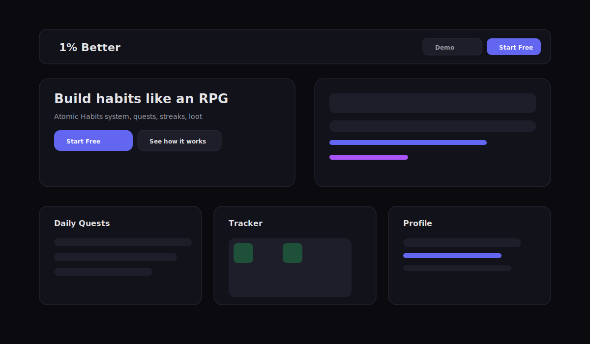

# 1% Better - RPG Habit Tracker

1% Better is a gamified habit tracker PWA inspired by Atomic Habits. Build consistency through daily quests, XP progression, streaks, and cosmetic rewards.

## Screenshot



## Portfolio Flow

1. Visitor lands on the public landing page.
2. Demo mode shows read-only sample data.
3. Login (email or Google) unlocks the full app.
4. Create a habit using identity and the 4 Laws method.
5. Complete daily quests to earn XP and gold.
6. Track streaks in the calendar view.
7. Review stats in profile and equip loot from inventory.

## Highlights

- Habit quests with streak tracking and daily completion flow
- RPG progression: levels, ranks, XP, gold, and loot
- Tracker calendar for monthly visibility
- Focus mode (pomodoro-style) with XP multiplier
- Inventory for titles, badges, and themes
- PWA installable for offline-first usage
- Dark/light theme support

## Tech Stack

- Next.js 14 (App Router)
- TypeScript
- Tailwind CSS
- Supabase (Auth + Postgres)
- Lucide React
- PWA

## Database Schema

```
├── habits          # User habits with schedule
├── checkins        # Daily habit completions
├── player_profile  # Level, XP, gold, rank, equipped items
├── loot            # Collected titles, badges, themes
├── tasks           # Daily to-do items
├── daily_summary   # Aggregated daily stats
└── reward_ledger   # Reward tracking
```

## Getting Started

### Prerequisites

- Node.js 18+
- Supabase project

### Install

```bash
git clone https://github.com/radurbae/redemption.git
cd redemption
npm install
```

### Environment Variables

Create `.env.local`:

```env
NEXT_PUBLIC_SUPABASE_URL=your_supabase_url
NEXT_PUBLIC_SUPABASE_ANON_KEY=your_anon_key
```

### Migrations

Run the SQL files in `supabase/migrations/` using the Supabase SQL editor.

### Development

```bash
npm run dev
```

## Reward System

| Action | XP | Gold |
|--------|----|------|
| Complete task | +5 | +3 |
| Complete habit | +10 | +5 |
| Streak bonus | +1 per day (max 10) | - |
| Daily clear bonus | +5 | +20 |
| Dungeon run | x2 multiplier | - |

### Level Curve

```
XP required = 50 + (level x 25)
```

### Rank Thresholds

| Rank | Level | Weekly Rate |
|------|-------|-------------|
| E | 1+ | 0% |
| D | 5+ | 40% |
| C | 10+ | 50% |
| B | 15+ | 60% |
| A | 20+ | 80% |
| S | 30+ | 90% |
| SS | 50+ | 95% |

## Deployment

The app deploys to Vercel on push to `main`.

```bash
npm run build
npm start
```

## License

MIT
